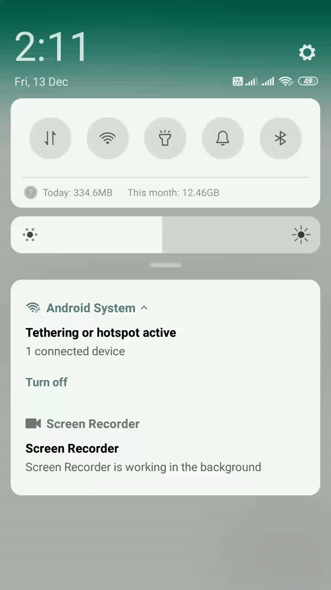

# 🔔 FCM - Push Notification Scheduler⏰ (On Device 📱) 
This is demo app to implement FCM On Device Push Notification Scheduling using `AlarmManager` and `WorkManager`.

### Show some :heart: and star the repo to support the project

[](https://github.com/PatilShreyas/FCM-OnDeviceNotificationScheduler) [](https://github.com/PatilShreyas/FCM-OnDeviceNotificationScheduler/fork) [](https://github.com/PatilShreyas/FCM-OnDeviceNotificationScheduler) [](https://github.com/PatilShreyas)
[](https://twitter.com/imShreyasPatil)
[](LICENSE)

## Introduction
- We can use [***Cloud Pub/Sub***](https://firebase.google.com/docs/functions/schedule-functions) with [***Firebase Cloud Functions***](https://firebase.google.com/docs/functions) to send FCM Push Notifications. But this solution is costly to implement.
- Here, We are using regular FCM Push Notifications and scheduling it *on device*.

In this demo app, We are subscribing to a FCM Channel *`discount-offers`*. We'll receive **Data** payload from FCM to this subscribed channel and we will process and schedule it.

## Dependencies
- [**`Firebase Messaging`**](https://firebase.google.com/docs/cloud-messaging/android/client) - Firebase Cloud Messaging Library.
- **`Firebase IID`** - Firebase Instance ID Library.
- [**`WorkManager`**](https://developer.android.com/topic/libraries/architecture/workmanager) - Used for Background Work Processing.

## Setup
- Setup project in Firebase Console.
- Download and paste `google-services.json`  configuration file in `/app` directory.
- Keep legacy API key for FCM Push Notification REST.

## Implementation Structure

```
src
│
└───fcm
│   │   MyFirebaseMessagingService.kt
│   │   NotificationBroadcastReceiver.kt
│   │   ScheduledWorker.kt
│   
└───util
|   │   NotificationUtil.kt
|   │   SettingUtil.kt
|
└───ui
|   │   MainActivity.kt
|   
```

- ***`MyFirebaseMessagingService`***: FCM Receiver Service Implementation. Process of Notification Scheduling using `AlarmManager` is implemented here.
- ***`NotificationBroadcastReceiver`***: `BroadcastReceiver` Implementation. Executed when AlarmManager is triggered. WorkManager is initiated and executed for background processing.
- ***`ScheduledWorker`***: `WorkManager` Implementation. Notification is displayed in the system tray and other background processed are executed.

- ***`NotificationUtil`***: Implementation to display Notification on the system tray.
- ***`SettingUtil`***: Function implementation to check whether *Automatic Date & Time* setting is ON/OFF.

- ***`MainActivity`***: UI Implementation to subscribe to FCM Channel.

## What's Happening? 🤔
- Subscribe to *`discount-offers`* FCM Channel from Android Device.
- **Data Payload** will be as follows
```json
 { 
    "to": "/topics/discount-offers", 
    "priority": "high",
    "data" : {
      "title" : "TITLE_HERE",
      "message" : "MESSAGE_HERE",
      "isScheduled" : "true",
      "scheduledTime" : "2019-12-13 09:41:00"
    }
}
```
  *Format of `scheduledTime`: **YYYY-MM-DD HH:MM:SS***
- Receive FCM on device and `onMessageReceived()` in [`MyFirebaseMessagingService`](https://github.com/PatilShreyas/FCM-OnDeviceNotificationScheduler/blob/master/app/src/main/java/com/spdroid/schedulefcm/example/fcm/MyFirebaseMessagingService.kt) will be invoked. In this, following operations will be done-
  - If `isScheduled` parameter received is `false` then notifications is displayed in system tray **instantly**.
  - If `isScheduled` is `true` then `scheduledTime` is parsed from payload and `AlarmManager` is used to set *one-time* alarm at that time and [`NotificationBroadcastReceiver`](https://github.com/PatilShreyas/FCM-OnDeviceNotificationScheduler/blob/master/app/src/main/java/com/spdroid/schedulefcm/example/fcm/NotificationBroadcastReceiver.kt) implementation will be executed on that time.
  - In `onReceive()`, we have scheduled a *WorkManager* [`ScheduledWorker`](https://github.com/PatilShreyas/FCM-OnDeviceNotificationScheduler/blob/master/app/src/main/java/com/spdroid/schedulefcm/example/fcm/ScheduledWorker.kt) for background work processing. There in `doWork()`, we're finally we're displaying Notification on system tray. Do any background proessing and return status from *WorkManager*.
  
Hurrah!😍 we have successfully implemented On-Device Scheduling of FCM Push Notification👍.

## Let's Test It
I have sent below payload with to the FCM Channel (*`discount-offers`*).

```json
{ 
 "to": "/topics/discount-offers", 
 "priority": "high",
 "data" : {
  "title" : "🎅 Christmas Offer 🎄",
  "message" : "Grab 90% Discount 😍 on Mobile Phones",
  "isScheduled" : "true",
  "scheduledTime" : "2019-12-13 14:12:00"
 }
}
```

🚀See output below and notice that **Internet/Wi-Fi** is ***OFF*** still at exactly 02:12 pm I'm getting a notification on the system tray 😃.



Yippie 😍! It's working as expected. Hope you liked that. If you find it helpful please share this. Maybe it'll help someone needy!


### :heart: Found this project useful?
If you found this project useful, then please consider giving it a :star: on Github and sharing it with your friends via social media.
> Sharing is Caring!

## Connect With Me
If you want to contact me, feel free to reach me…
Visit [My Profile](https://patilshreyas.github.io).

## License
```
MIT License

Copyright (c) 2019 Shreyas Patil

Permission is hereby granted, free of charge, to any person obtaining a copy
of this software and associated documentation files (the "Software"), to deal
in the Software without restriction, including without limitation the rights
to use, copy, modify, merge, publish, distribute, sublicense, and/or sell
copies of the Software, and to permit persons to whom the Software is
furnished to do so, subject to the following conditions:

The above copyright notice and this permission notice shall be included in all
copies or substantial portions of the Software.

THE SOFTWARE IS PROVIDED "AS IS", WITHOUT WARRANTY OF ANY KIND, EXPRESS OR
IMPLIED, INCLUDING BUT NOT LIMITED TO THE WARRANTIES OF MERCHANTABILITY,
FITNESS FOR A PARTICULAR PURPOSE AND NONINFRINGEMENT. IN NO EVENT SHALL THE
AUTHORS OR COPYRIGHT HOLDERS BE LIABLE FOR ANY CLAIM, DAMAGES OR OTHER
LIABILITY, WHETHER IN AN ACTION OF CONTRACT, TORT OR OTHERWISE, ARISING FROM,
OUT OF OR IN CONNECTION WITH THE SOFTWARE OR THE USE OR OTHER DEALINGS IN THE
SOFTWARE.
```
